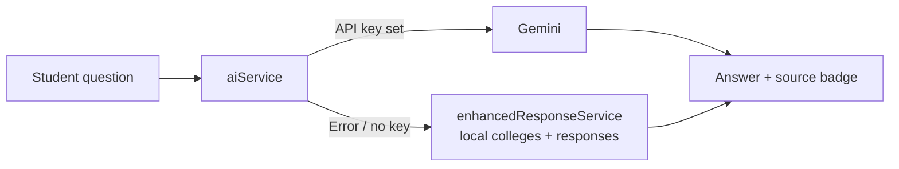

<div align="center">

# 🎓 Aspirofy (StudentTalk Chatbot)

### An AI college-selection assistant for students from Jammu & Kashmir.

Ask about colleges, courses, eligibility, admissions and scholarships. Get direct answers from Google Gemini, with a built-in knowledge base as a fallback.

[](https://react.dev/)
[](https://www.typescriptlang.org/)
[](https://vitejs.dev/)
[](https://tailwindcss.com/)
[](https://ai.google.dev/)
[](LICENSE)

[](https://github.com/HarshCoder1122/studenttalkchatbot/commits/main)
[](https://github.com/HarshCoder1122/studenttalkchatbot/issues)

</div>

## Table of contents

- [Why](#why)
- [Features](#features)
- [How it works](#how-it-works)
- [Tech stack](#tech-stack)
- [Getting started](#getting-started)
- [Configuration](#configuration)
- [Project structure](#project-structure)
- [Scripts](#scripts)
- [Roadmap](#roadmap)
- [Contributing](#contributing)
- [License](#license)

## Why

Choosing a college is stressful, and good local information is scattered. This chatbot gives students in J&K one place to ask plain-language questions such as "Which colleges offer engineering?" or "What is the eligibility for NIT Srinagar?" and get a specific, structured answer.

## Features

- **Conversational UI**: a clean chat interface with typing indicator and message bubbles.
- **Quick suggestions**: one-tap starter questions for common queries.
- **AI answers**: Google Gemini with a prompt tuned for J&K colleges, courses, admissions, careers and scholarships.
- **Offline fallback**: if Gemini is unavailable or no key is set, answers come from a curated local dataset, and a badge shows which source replied.
- **Built-in college data**: NIT Srinagar, University of Kashmir, University of Jammu, medical colleges, IUST, Central University of Kashmir, SKUAST and more, with courses, eligibility and websites.
- **Guided setup**: an in-app instructions panel helps you add your API key.

## How it works



## Tech stack

| Layer | Technology |
|---|---|
| UI | React 18, TypeScript, Tailwind CSS, Lucide icons |
| Build | Vite 5 |
| AI | `@google/generative-ai` (Gemini) |
| Lint | ESLint with typescript-eslint |

## Getting started

### Prerequisites

- Node.js 18+ and npm
- A free [Gemini API key](https://makersuite.google.com/app/apikey) (optional; the app works with fallback answers without it)

### Install and run

```bash
git clone https://github.com/HarshCoder1122/studenttalkchatbot.git
cd studenttalkchatbot
npm install
cp .env.example .env    # then add your key
npm run dev
```

Open the URL Vite prints (usually `http://localhost:5173`).

## Configuration

Copy [.env.example](.env.example) to `.env`:

```env
VITE_GEMINI_API_KEY=your_gemini_api_key_here
```

> Vite exposes `VITE_*` variables to the browser bundle. For a public deployment, proxy Gemini calls through a small backend so your key is not visible to users.

## Project structure

```text
studenttalkchatbot/
├── src/
│   ├── components/   # ChatContainer, MessageBubble, MessageInput, QuickSuggestions, ...
│   ├── services/     # aiService (Gemini), enhancedResponseService (fallback)
│   ├── data/         # colleges.ts, responses.ts
│   ├── types/
│   ├── App.tsx
│   └── main.tsx
├── public/
├── index.html
└── vite.config.ts
```

## Scripts

| Command | What it does |
|---|---|
| `npm run dev` | Start the dev server |
| `npm run build` | Production build into `dist/` |
| `npm run preview` | Preview the production build |
| `npm run lint` | Run ESLint |

## Roadmap

- [ ] Move Gemini calls behind a backend proxy
- [ ] Expand the dataset with cut-offs and fee structures
- [ ] Add Hindi and Urdu support
- [ ] Persist chat history

## Contributing

Additions to the college dataset are especially useful. Please read [CONTRIBUTING.md](CONTRIBUTING.md) and follow the [Code of Conduct](CODE_OF_CONDUCT.md).

## License

Released under the [MIT License](LICENSE).

<div align="center"><sub>Built by <a href="https://github.com/HarshCoder1122">Harsh</a> for students of Jammu & Kashmir.</sub></div>
